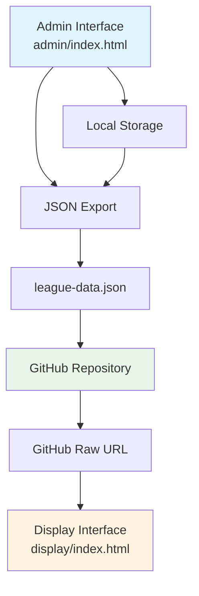
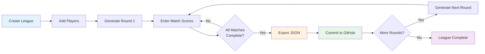
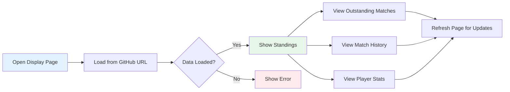

# Swiss-Format Snooker League Management System - Architecture Plan

## Overview

A dual-interface web application for managing a Swiss-format Snooker league with:
- **Admin Interface**: Local management tool for league creation, player management, round generation, and score entry
- **Display Interface**: Public-facing view that reads league data from GitHub repository

## System Architecture



## Data Model

### JSON Schema Structure

```json
{
  "league": {
    "id": "uuid",
    "name": "League Name",
    "format": "swiss",
    "bestOfFrames": 5,
    "createdAt": "ISO-8601 timestamp",
    "updatedAt": "ISO-8601 timestamp",
    "currentRound": 1,
    "totalRounds": 7
  },
  "players": [
    {
      "id": "uuid",
      "name": "Player Name",
      "active": true,
      "stats": {
        "matchesPlayed": 0,
        "matchesWon": 0,
        "matchesLost": 0,
        "framesWon": 0,
        "framesLost": 0,
        "points": 0,
        "frameDifference": 0
      }
    }
  ],
  "rounds": [
    {
      "roundNumber": 1,
      "status": "completed|in-progress|pending",
      "matches": [
        {
          "id": "uuid",
          "player1Id": "uuid",
          "player2Id": "uuid|null",
          "status": "completed|in-progress|pending",
          "frames": [
            {
              "frameNumber": 1,
              "player1Score": 65,
              "player2Score": 42,
              "winnerId": "uuid"
            }
          ],
          "player1FramesWon": 3,
          "player2FramesWon": 2,
          "winnerId": "uuid",
          "isBye": false
        }
      ]
    }
  ],
  "pairingHistory": [
    ["player1Id", "player2Id"]
  ]
}
```

## Component Breakdown

### Admin Interface Components

#### 1. League Setup Module
- Create new league with name and best-of-N frames configuration
- Edit league settings
- Reset league (with confirmation)
- Import existing league from JSON file

#### 2. Player Management Module
- Add new players with name validation
- Edit player names
- Mark players as inactive (soft delete)
- View player list with current stats
- Bulk import players from CSV/text

#### 3. Round Generation Module
- Generate next round pairings using Swiss algorithm
- Display proposed pairings before confirmation
- Handle bye assignment for odd number of players
- Show pairing rationale (score groups, avoiding repeats)

#### 4. Score Entry Module
- Select match from current round
- Enter frame-by-frame scores
- Validate scores and determine frame winners
- Auto-calculate match winner when best-of-N threshold reached
- Edit/correct previously entered scores
- Mark matches as complete

#### 5. Data Management Module
- Export league data as JSON file
- Import league data from JSON file
- Clear local storage (with confirmation)
- View raw JSON data for debugging

### Display Interface Components

#### 1. League Header
- League name and format information
- Current round indicator
- Last updated timestamp

#### 2. Standings Table
- Sortable columns: Rank, Player Name, Points, Matches Played, Wins, Losses, Frames Won, Frames Lost, Frame Difference
- Default sort: Points (desc), then Frame Difference (desc)
- Highlight top 3 players
- Responsive table design

#### 3. Outstanding Matches View
- List of pending matches in current round
- Show player names and match status
- Filter by round number

#### 4. Match History
- Chronological list of completed matches
- Expandable details showing frame-by-frame scores
- Filter by round, player, or date
- Search functionality

#### 5. Player Statistics
- Individual player cards with detailed stats
- Win rate percentage
- Average frames per match
- Head-to-head records against other players
- Performance trend over rounds

#### 6. Data Source Configuration
- Input field for GitHub raw JSON URL
- Save URL to browser local storage
- Manual refresh button to reload data

## Swiss Pairing Algorithm

### Algorithm Steps

1. **Calculate Current Standings**
   - Sort players by points (descending)
   - Use frame difference as tiebreaker
   - Use frames won as secondary tiebreaker

2. **Create Score Groups**
   - Group players with identical points
   - Within each group, sort by frame difference

3. **Pair Within Groups**
   - Start with highest score group
   - Attempt to pair top player with next available player
   - Check pairing history to avoid repeats
   - If repeat pairing unavoidable, allow it but track
   - Move down the group until all paired

4. **Handle Cross-Group Pairing**
   - If odd number in a group, pair lowest player with highest from next group
   - Maintain score proximity when possible

5. **Assign Bye**
   - If odd total players, assign bye to lowest-ranked player who hasn't had one
   - Bye counts as automatic win (2 points, frames based on best-of-N)

6. **Validate Pairings**
   - Ensure no duplicate pairings in same round
   - Ensure all active players are included
   - Log pairing decisions for transparency

### Edge Cases
- First round: Random or seeded pairings
- Odd number of players: Rotating bye system
- All possible pairings exhausted: Allow repeat pairings
- Player becomes inactive mid-tournament: Handle in next round generation

## File Structure

```
swissleague/
├── admin/
│   ├── index.html
│   ├── styles.css
│   ├── app.js
│   ├── modules/
│   │   ├── league.js
│   │   ├── players.js
│   │   ├── rounds.js
│   │   ├── scoring.js
│   │   ├── swiss-pairing.js
│   │   └── storage.js
│   └── utils/
│       ├── validation.js
│       └── helpers.js
├── display/
│   ├── index.html
│   ├── styles.css
│   ├── app.js
│   ├── modules/
│   │   ├── standings.js
│   │   ├── matches.js
│   │   ├── statistics.js
│   │   └── data-loader.js
│   └── utils/
│       └── helpers.js
├── shared/
│   └── constants.js
├── plans/
│   └── architecture.md
├── README.md
└── .gitignore
```

## Technology Stack

- **HTML5**: Semantic markup for both interfaces
- **CSS3**: Responsive design with flexbox/grid, mobile-first approach
- **Vanilla JavaScript (ES6+)**: No frameworks, modular architecture
- **Local Storage API**: Client-side persistence for admin interface
- **Fetch API**: Loading JSON data from GitHub in display interface
- **GitHub Pages**: Static hosting for both interfaces

## User Workflows

### Admin Workflow



### Display Workflow



## Key Features

### Admin Interface Features
- ✅ Offline-first design with local storage
- ✅ Real-time validation and error messages
- ✅ Undo/edit capabilities for score entry
- ✅ Export/import for backup and portability
- ✅ Responsive design for tablet use during matches
- ✅ Keyboard shortcuts for faster data entry
- ✅ Confirmation dialogs for destructive actions

### Display Interface Features
- ✅ Clean, read-only public view
- ✅ Sortable and filterable tables
- ✅ Responsive design for all devices
- ✅ Print-friendly styling
- ✅ Shareable URL with embedded data source
- ✅ Error handling for network issues
- ✅ Loading states and user feedback

## GitHub Pages Deployment

### Admin Interface
- Deploy to: `https://username.github.io/swissleague/admin/`
- Used privately by league administrator
- No sensitive data exposure (all client-side)

### Display Interface
- Deploy to: `https://username.github.io/swissleague/display/`
- Public-facing URL to share with league participants
- Reads from: `https://raw.githubusercontent.com/username/swissleague/main/data/league-data.json`

### Data Storage
- Store exported JSON in repository at `/data/league-data.json`
- Commit and push after each round completion
- Display interface automatically fetches latest version

## Security Considerations

- No authentication required (public league data)
- Admin interface runs entirely client-side
- No API keys or secrets needed
- GitHub repository can be public or private
- If private, use GitHub personal access token in display interface URL

## Performance Considerations

- Minimize DOM manipulation with virtual rendering
- Lazy load match history for large datasets
- Cache GitHub data in display interface session storage
- Optimize Swiss pairing algorithm for up to 100 players
- Use CSS animations sparingly for better mobile performance

## Accessibility

- Semantic HTML5 elements
- ARIA labels for interactive elements
- Keyboard navigation support
- Sufficient color contrast ratios
- Screen reader friendly tables
- Focus indicators for form inputs

## Testing Strategy

### Unit Testing Scenarios
- Swiss pairing algorithm with various player counts
- Score calculation and validation
- Frame winner determination
- Bye assignment logic
- Data import/export integrity

### Integration Testing Scenarios
- Complete league lifecycle (create → rounds → completion)
- Local storage persistence across sessions
- JSON export/import round-trip
- GitHub data fetching with various network conditions

### User Acceptance Testing
- Create league with 8 players, run 7 rounds
- Test with odd number of players (bye handling)
- Verify standings calculations match manual calculations
- Test score entry error correction
- Verify display interface shows correct data from GitHub

## Future Enhancements (Out of Scope)

- Multi-league support
- Player authentication and self-service score entry
- Real-time updates using WebSockets
- Advanced statistics (break tracking, century counts)
- Tournament bracket visualization
- Email notifications for match pairings
- Mobile native apps
- Backend API with database

## Success Criteria

1. Admin interface successfully creates league and manages players
2. Swiss pairing algorithm generates valid pairings avoiding repeats
3. Score entry correctly calculates match winners and updates standings
4. JSON export contains complete league state
5. Display interface loads and renders data from GitHub repository
6. Both interfaces are responsive and usable on mobile devices
7. Complete workflow tested with real league scenario
8. Documentation enables deployment to GitHub Pages

## Next Steps

Once this plan is approved, the implementation will proceed in the following order:

1. Set up project structure and shared utilities
2. Implement data model and storage layer
3. Build admin interface core functionality
4. Develop and test Swiss pairing algorithm
5. Create display interface with GitHub integration
6. Apply styling and responsive design
7. Comprehensive testing and bug fixes
8. Documentation and deployment guide
