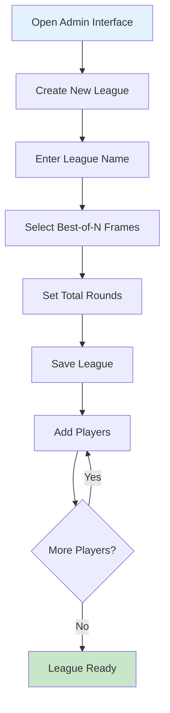
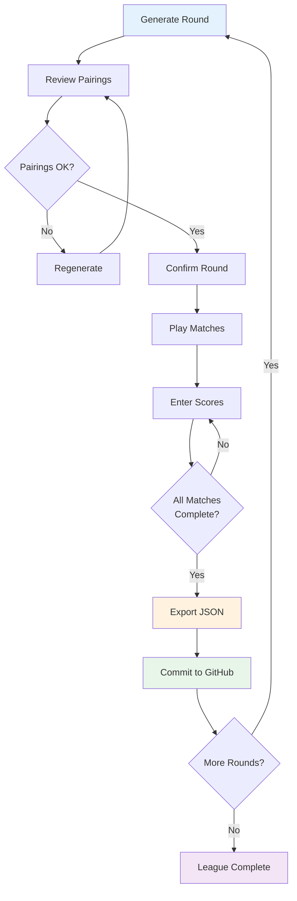

# Swiss Snooker League - Deployment & Usage Guide

## GitHub Pages Deployment Strategy

### Repository Structure

```
swissleague/
├── admin/              # Admin interface (private use)
│   ├── index.html
│   ├── styles.css
│   └── app.js
├── display/            # Display interface (public)
│   ├── index.html
│   ├── styles.css
│   └── app.js
├── data/               # League data storage
│   └── league-data.json
├── docs/               # Documentation
│   └── user-guide.md
└── README.md
```

### Deployment Steps

#### 1. Initial Repository Setup

```bash
# Create and initialize repository
git init
git add .
git commit -m "Initial commit: Swiss Snooker League system"

# Create GitHub repository (via GitHub web interface or CLI)
gh repo create swissleague --public --source=. --remote=origin

# Push to GitHub
git push -u origin main
```

#### 2. Enable GitHub Pages

1. Go to repository Settings
2. Navigate to "Pages" section
3. Under "Source", select branch: `main`
4. Select folder: `/ (root)`
5. Click "Save"
6. GitHub Pages will be available at: `https://username.github.io/swissleague/`

#### 3. Configure URLs

**Admin Interface URL:**
```
https://username.github.io/swissleague/admin/
```

**Display Interface URL:**
```
https://username.github.io/swissleague/display/
```

**Raw JSON Data URL:**
```
https://raw.githubusercontent.com/username/swissleague/main/data/league-data.json
```

#### 4. Set Up Display Interface Data Source

In the display interface, configure the GitHub raw URL:
1. Open `https://username.github.io/swissleague/display/`
2. Enter the raw JSON URL in the configuration section
3. The URL will be saved to browser local storage
4. Click "Load Data" to fetch and display league information

## Workflow for League Management

### Phase 1: League Setup (Admin Interface)



**Steps:**
1. Navigate to admin interface
2. Click "Create New League"
3. Fill in league details:
   - League name (e.g., "Winter 2026 Snooker League")
   - Best of frames (3, 5, 7, or 9)
   - Total rounds (typically 7 for Swiss format)
4. Click "Create League"
5. Add players one by one:
   - Enter player name
   - Click "Add Player"
   - Repeat for all participants
6. Review player list
7. League is now ready for round generation

### Phase 2: Round Management



**Steps:**

#### Generate Round
1. Click "Generate Next Round"
2. System calculates pairings using Swiss algorithm
3. Review proposed pairings:
   - Check for any repeat pairings (highlighted if unavoidable)
   - Note bye assignment (if odd number of players)
4. Click "Confirm Pairings" to create round

#### Enter Match Results
1. Navigate to "Score Entry" section
2. Select match from current round
3. Enter frame-by-frame scores:
   - Frame 1: Player 1 score, Player 2 score
   - Frame 2: Player 1 score, Player 2 score
   - Continue until match winner determined
4. System automatically:
   - Validates scores
   - Determines frame winners
   - Calculates match winner when threshold reached
   - Updates player statistics
5. Click "Save Match" to record results
6. Repeat for all matches in round

#### Export and Publish
1. Once all matches in round are complete
2. Click "Export JSON"
3. Save file as `league-data.json`
4. Commit to GitHub:
   ```bash
   # Copy exported file to data directory
   cp ~/Downloads/league-data.json ./data/
   
   # Commit and push
   git add data/league-data.json
   git commit -m "Update: Round X results"
   git push origin main
   ```
5. Display interface will show updated data on next page load

### Phase 3: Public Viewing (Display Interface)

**For League Participants:**
1. Navigate to display interface URL
2. Page automatically loads latest data from GitHub
3. View available information:
   - Current standings
   - Outstanding matches
   - Match history
   - Player statistics
4. Refresh browser page to see latest updates

**Sharing the Display URL:**
- Share the display interface URL with all participants
- Optionally create a QR code for easy mobile access
- Display URL on venue screen during league nights

## Data Management Best Practices

### Backup Strategy

1. **Automatic Browser Backup**
   - Admin interface auto-saves to local storage
   - Survives browser restarts
   - Limited to single device

2. **Manual JSON Exports**
   - Export after each round completion
   - Keep local copies in organized folder structure:
     ```
     backups/
     ├── 2026-01-13-round-1.json
     ├── 2026-01-20-round-2.json
     └── 2026-01-27-round-3.json
     ```

3. **GitHub Repository**
   - Primary source of truth
   - Version controlled
   - Accessible from anywhere
   - Can revert to previous states if needed

### Recovery Procedures

**Scenario 1: Browser Data Lost**
1. Open admin interface
2. Click "Import JSON"
3. Select most recent backup file
4. System restores complete league state

**Scenario 2: Incorrect Score Entry**
1. Navigate to match in question
2. Click "Edit Match"
3. Modify frame scores
4. System recalculates statistics
5. Export and commit updated data

**Scenario 3: Need to Revert Round**
1. Find previous JSON backup (before round)
2. Import into admin interface
3. Regenerate round with corrections
4. Continue from corrected state

## GitHub Repository Management

### Commit Message Conventions

```bash
# Initial setup
git commit -m "Initial commit: League setup"

# After round completion
git commit -m "Update: Round 1 results - 8 matches completed"

# Player changes
git commit -m "Update: Added new player - John Smith"

# Corrections
git commit -m "Fix: Corrected Round 2 Match 3 scores"

# League completion
git commit -m "Final: League completed - 7 rounds"
```

### Branch Strategy (Optional)

For larger leagues or testing:

```bash
# Create development branch for testing
git checkout -b development

# Make changes and test
# ... test changes ...

# Merge to main when confirmed
git checkout main
git merge development
git push origin main
```

## Troubleshooting Guide

### Common Issues and Solutions

#### Issue 1: Display Interface Shows Old Data

**Symptoms:**
- Display shows outdated standings
- Recent matches not visible

**Solutions:**
1. Hard refresh browser: `Ctrl+F5` (Windows) or `Cmd+Shift+R` (Mac)
2. Clear browser cache
3. Verify GitHub commit was successful
4. Check raw JSON URL is correct
5. Wait 1-2 minutes for GitHub CDN to update

#### Issue 2: Admin Interface Lost Data

**Symptoms:**
- League data disappeared
- Players or rounds missing

**Solutions:**
1. Check browser local storage wasn't cleared
2. Import most recent JSON backup
3. Check if using different browser/device
4. Verify not in incognito/private mode

#### Issue 3: Pairing Generation Fails

**Symptoms:**
- Error when generating round
- Unexpected pairings

**Solutions:**
1. Verify all previous round matches are completed
2. Check player active status
3. Review pairing history for conflicts
4. Try regenerating round
5. Check browser console for error details

#### Issue 4: Score Validation Errors

**Symptoms:**
- Cannot save frame scores
- Validation error messages

**Solutions:**
1. Ensure scores are non-negative integers
2. Verify scores are not equal (must have winner)
3. Check scores don't exceed 147 (maximum break)
4. Ensure match isn't already completed
5. Verify correct match is selected

#### Issue 5: GitHub Pages Not Updating

**Symptoms:**
- Changes not visible on GitHub Pages
- 404 errors

**Solutions:**
1. Verify GitHub Pages is enabled in repository settings
2. Check correct branch is selected (main)
3. Wait 1-5 minutes for GitHub Pages to rebuild
4. Clear browser cache
5. Check repository is public (or token configured for private)

## Performance Optimization

### For Large Leagues (20+ Players)

1. **Limit Match History Display**
   - Show only recent 50 matches by default
   - Add "Load More" button for older matches

2. **Optimize Pairing Algorithm**
   - Algorithm handles up to 100 players efficiently
   - Consider splitting very large leagues into divisions

3. **Reduce JSON File Size**
   - Remove unnecessary whitespace in production
   - Consider compressing frame-by-frame data for completed rounds

### Mobile Optimization

1. **Admin Interface on Tablet**
   - Use landscape orientation for score entry
   - Enable keyboard shortcuts for faster input
   - Consider external keyboard for extensive data entry

2. **Display Interface on Mobile**
   - Responsive tables with horizontal scroll
   - Collapsible sections for better navigation
   - Touch-friendly buttons and links

## Security Considerations

### Public Repository

**Advantages:**
- No authentication needed
- Easy sharing
- Free GitHub Pages hosting

**Considerations:**
- League data is publicly visible
- Anyone can view standings and results
- Suitable for recreational leagues

### Private Repository

**Advantages:**
- Data not publicly searchable
- More control over access

**Requirements:**
- GitHub Pro account (for private repo Pages)
- Or use personal access token in display interface
- Configure token with read-only repo access

**Token Setup:**
```javascript
// In display interface, modify fetch URL
const token = 'ghp_your_token_here';
fetch(dataUrl, {
  headers: {
    'Authorization': `token ${token}`
  }
})
```

## Maintenance Schedule

### During Active League

**After Each Match Night:**
1. Enter all match results (15-30 minutes)
2. Review standings for accuracy
3. Export JSON backup
4. Commit to GitHub
5. Verify display interface shows updates

**Before Next Round:**
1. Generate next round pairings
2. Review and confirm pairings
3. Export updated JSON
4. Commit to GitHub
5. Notify players of pairings (optional)

### End of League

**Final Steps:**
1. Enter all final match results
2. Verify final standings
3. Export final JSON with timestamp
4. Create archive backup
5. Generate final statistics report
6. Consider exporting to PDF for records

**Cleanup:**
1. Keep repository for historical reference
2. Or archive repository on GitHub
3. Download all JSON backups locally
4. Clear admin interface local storage if starting new league

## Advanced Features

### Custom Scoring Rules

If you need to modify scoring (e.g., 3 points for win, 1 for loss):

1. Edit [`storage.js`](../admin/modules/storage.js) constants
2. Update point calculation in [`scoring.js`](../admin/modules/scoring.js)
3. Modify display calculations in [`standings.js`](../display/modules/standings.js)
4. Test thoroughly before using in production

### Multi-League Support

To manage multiple leagues:

1. Use separate repositories for each league
2. Or use different JSON files: `league-1.json`, `league-2.json`
3. Modify admin interface to support league selection
4. Update display interface to accept league parameter

### Integration with Other Tools

**Export to Spreadsheet:**
```javascript
// Add CSV export function
function exportToCSV(leagueData) {
  const standings = calculateStandings(leagueData);
  const csv = convertToCSV(standings);
  downloadFile(csv, 'standings.csv');
}
```

**Print-Friendly Reports:**
- Display interface includes print CSS
- Use browser print function (Ctrl+P)
- Generates clean standings report

## Support and Resources

### Documentation Files

- [`architecture.md`](./architecture.md) - System design and architecture
- [`technical-specification.md`](./technical-specification.md) - Detailed technical specs
- `user-guide.md` - End-user instructions (to be created)

### Getting Help

1. Check browser console for error messages
2. Review this troubleshooting guide
3. Verify JSON data structure is valid
4. Test with sample data first
5. Check GitHub repository issues

### Future Enhancements

Potential features for future versions:
- Automated pairing notifications via email
- Real-time updates using WebSockets
- Mobile app versions
- Advanced statistics and analytics
- Tournament bracket visualization
- Player rating system (ELO)
- Multi-format support (Round Robin, Knockout)

## Quick Reference

### Essential URLs

```
Admin Interface:    https://username.github.io/swissleague/admin/
Display Interface:  https://username.github.io/swissleague/display/
Raw JSON Data:      https://raw.githubusercontent.com/username/swissleague/main/data/league-data.json
```

### Key Commands

```bash
# Update league data
git add data/league-data.json
git commit -m "Update: Round X results"
git push origin main

# Create backup
cp data/league-data.json backups/backup-$(date +%Y%m%d).json

# View commit history
git log --oneline data/league-data.json
```

### Keyboard Shortcuts (Admin Interface)

- `Ctrl+S` - Save current changes
- `Ctrl+E` - Export JSON
- `Ctrl+N` - New round
- `Tab` - Navigate between score inputs
- `Enter` - Submit form/save

### Best Practices Checklist

- [ ] Export JSON after each round
- [ ] Keep local backups organized by date
- [ ] Commit to GitHub with descriptive messages
- [ ] Verify display interface after each update
- [ ] Review standings for accuracy
- [ ] Test pairing generation before confirming
- [ ] Use consistent naming conventions
- [ ] Document any custom modifications
- [ ] Keep browser and system updated
- [ ] Use reliable internet connection for GitHub operations

## Conclusion

This deployment guide provides comprehensive instructions for setting up, managing, and maintaining your Swiss-format Snooker league system. Follow the workflows and best practices outlined here to ensure smooth operation throughout your league season.

For technical implementation details, refer to the architecture and technical specification documents. For end-user instructions, see the user guide (to be created during implementation).
